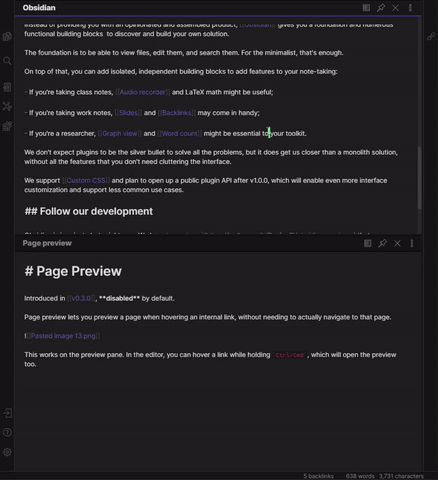

## Obsidian Plugin: Jump to link

Quickly jump between links using `Ctrl+'` hotkey.

You can switch between links presentation (modal or popovers).

Works with Obsidian 0.9.7

### Plans for future
- Fix issues
- Add custom hotkey for jump initiation
- Add support for standard markdown links
- Refactor draw modal and use API functionality

### How to install the plugin

- Copy over `main.js`, `styles.css`, `manifest.json` to your vault `vault/.obsidian/plugins/plugin-id/`.

For additional info check [this post](https://forum.obsidian.md/t/plugin-directory/6706?u=mrjackphil)

### Known issues
- When there are many links (more than English letters) others will appear with `undefined` keyword and can't be 
activated.

## Support

- [Patreon](https://patreon.com/mrjackphil)
- [Paypal](https://www.paypal.com/paypalme/mrjackphil)
