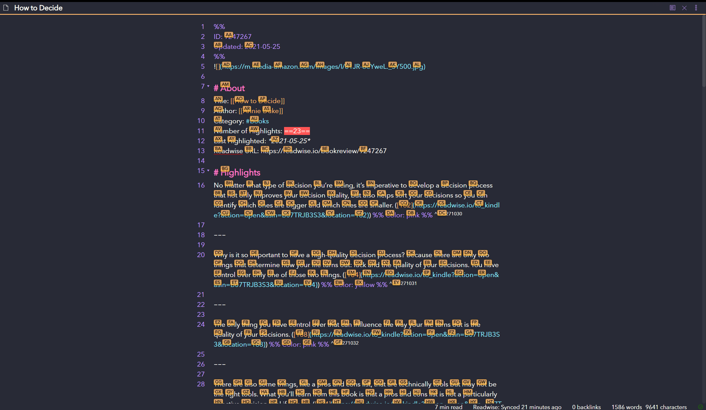

## Obsidian Plugin: Jump to link
Quickly navigate between links, or jump to any word on the page using hotkeys.

### Jump To Link

### Jump to Anywhere (RegEx based navigation)

### Settings

### How to use (Link Navigation)
- Open command pallete (`Ctrl+P`), find and choose `Jump to link` command
- You can use hotkey (`Ctrl + '` by default)
- If there any links in opened file you should see letters over them (or modal window with links and letters) which should be pressed to open the link
- You can switch between links presentation (modal or popovers).

### How to use Jump to Anywhere (Editor Navigation)
- Use the command pallete, or press the hotkey (`Ctrl + ;` by default) to instantly jump to any word on the page!
- Jump to Anywhere is a RegEx based navigation feature, similar to [`vim-easymotion`](https://github.com/easymotion/vim-easymotion).
- Jump to Anywhere works both in regular editor mode, and in VIM mode!
- Custom RegEx can be configured to user preference
- Default configuration adds a label on words 3 characters or greater: [Regex: `\b\w{3,}\b`]
- Suggested `Characters used for link hints` setting for Jump to Anywhere: `asdfghhjklqwertyuiopzxcvbnm`
  - This settings ensures that all 26 letters are available for jumping in documents with large amounts of text.
  - If there are more matches than available letters, the label will show `undefined` and it will not be possible to jump there.

### How to install the plugin

- Copy over `main.js`, `styles.css`, `manifest.json` to your vault `vault/.obsidian/plugins/plugin-id/`.

For additional info check [this post](https://forum.obsidian.md/t/plugin-directory/6706?u=mrjackphil)

Works with Obsidian 0.9.7

### Known issues
- Links that are scrolled out of view within an embedded note that scrolls don't get placed properly
- JumpToAnywhere Regex performance issues on large documents (runs out of letters and results in slow performance)
  - Possible Fixes
    - Raise number of possible combinations to 3 letters
    - Contain text selection only to visible lines

## Support

- [Patreon](https://patreon.com/mrjackphil)
- [Paypal](https://www.paypal.com/paypalme/mrjackphil)
