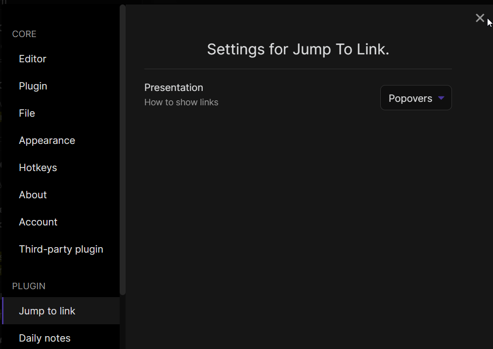

## Obsidian Plugin: Jump to link
Quickly navigate between links, or jump to any word on the page using hotkeys.

### Jump To Link


### Jump to Anywhere (RegEx based navigation)


### Lightspeed


### Settings


### How to use (Link Navigation)
- Open command palette (`Ctrl+P`), find and choose `Jump to link` command
- You can use hotkey (`Ctrl + '` by default)
- If there are any links in opened file you should see letters over them which should be pressed to open the link
- Hold `Shift` while pressing link letters should open note in a new pane

### How to use Jump to Anywhere (Editor Navigation)
- Use the command palette, or press the hotkey (`Ctrl + ;` by default) to instantly jump to any word on the page!
- If you hold `Shift` while pressing the hotkey, you will select to the word you jump to.
- Jump to Anywhere is a RegEx based navigation feature, similar to [`vim-easymotion`](https://github.com/easymotion/vim-easymotion).
- Jump to Anywhere works both in regular editor mode, and in VIM mode!
- Custom RegEx can be configured to user preference
- Default configuration adds a label on words 3 characters or greater: [Regex: `\b\w{3,}\b`]
- Suggested `Characters used for link hints` setting for Jump to Anywhere: `asdfghhjklqwertyuiopzxcvbnm`
  - These settings ensure that all 26 letters are available for jumping in documents with large amounts of text.
  - If there are more matches than available letters, the label will show `undefined` and it will not be possible to jump there.

### How to use Lightspeed

Lightspeed is originally a [vim plugin](https://github.com/ggandor/lightspeed.nvim) similar to vim-sneak or easymotion. See this [issue](https://github.com/mrjackphil/obsidian-jump-to-link/issues/35) for videos.

You can either assign a hotkey, or use it in combination with the [Obsidian vimrc plugin](https://github.com/esm7/obsidian-vimrc-support):

```vimrc
exmap jumpToLink obcommand mrj-jump-to-link:activate-lightspeed-jump
nmap gs :jumpToLink<CR>
```

The idea and original code is [from @kohane27](https://github.com/mrjackphil/obsidian-jump-to-link/issues/35#issuecomment-1085905668).

The look of it when invoked can be modified with CSS. By default, it is:

```css
.theme-dark, .theme-light {
  --jump-to-link-lightspeed-color: var(--text-muted);
}
```

Lightspeed is only supported in the new Codemirror 6 editor.

### How to install the plugin

Install plugin from the Community Plugins section.

### Known issues

## Support

- [Patreon](https://patreon.com/mrjackphil)
- [Paypal](https://www.paypal.com/paypalme/mrjackphil)
